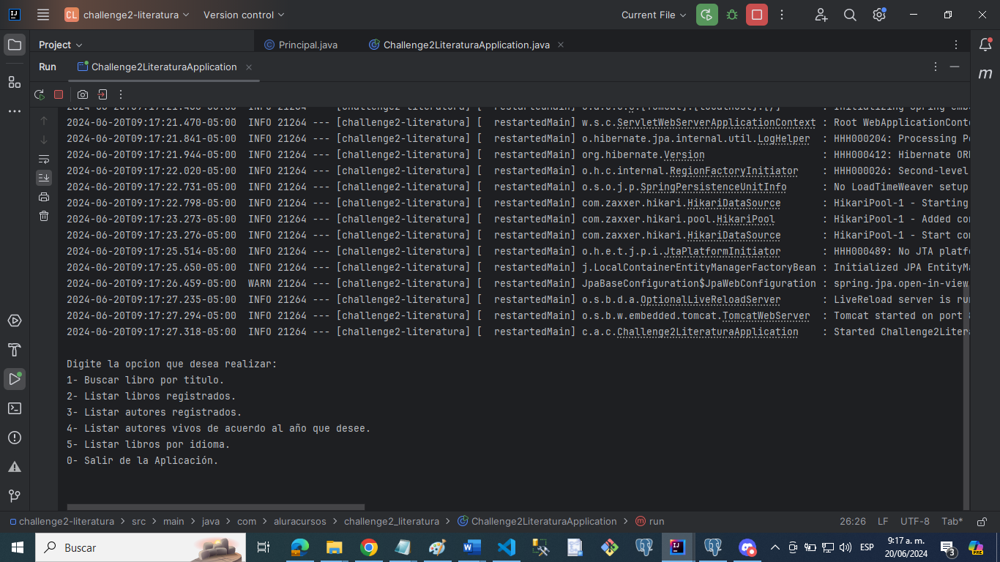
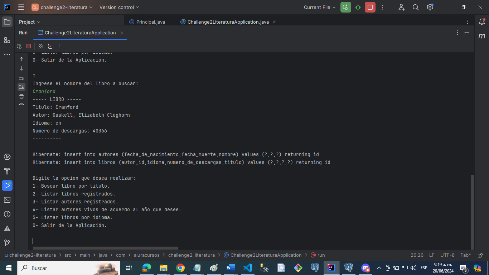
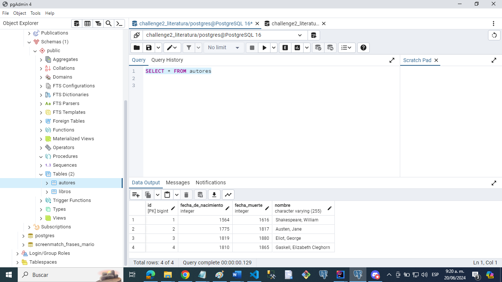
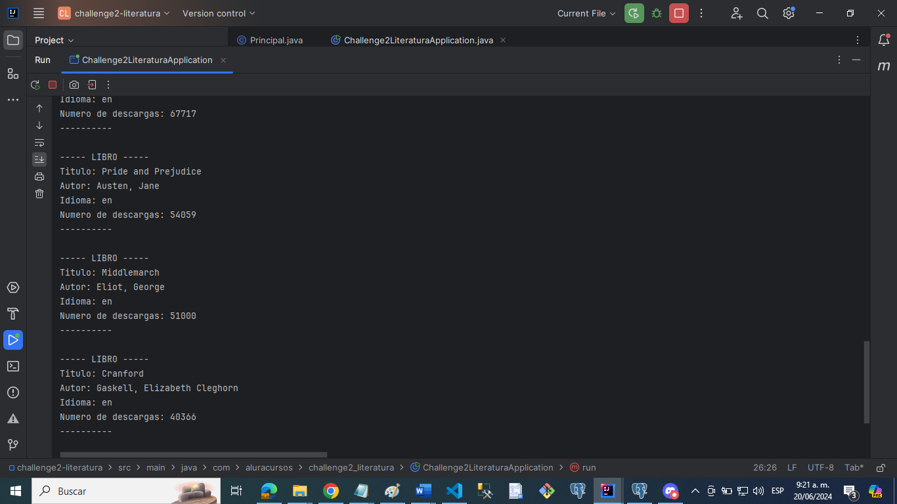
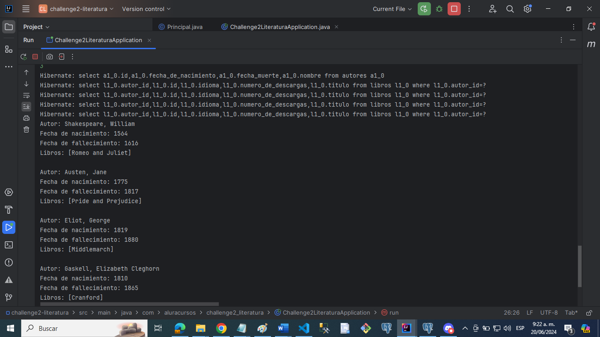
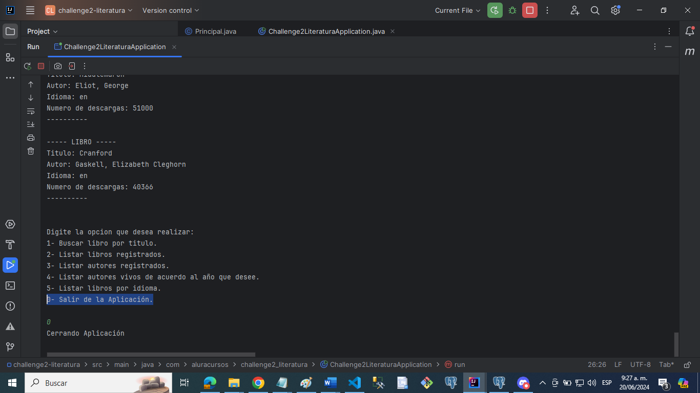

# CHALLENGE LITERATURA

Para el proyecto se eesarrolló un Catálogo de Libros que ofrece interacción textual (vía consola) con los usuarios, proporcionando al menos 5 opciones de interacción. Los libros se buscarán a través de una API específica. 

Los pasos que se realizaron para completar este desafío son:

Configuración del Ambiente Java;
Creación del Proyecto;
Consumo de la API;
Análisis de la Respuesta JSON;
Inserción y consulta en la base de datos;
Exibición de resultados a los usuarios;

## Ejecutando las pruebas ⚙️

_Ejecución del programa:

_Opción 1- Buscar libro por titulo.

_Busqueda del libro y verificación de datos agregados a la Base de Datos Postgres.

_Opción 2- Listar libros registrados.

_Opción 3- Listar autores registrados.

_Opción 4- Listar autores vivos de acuerdo al año que desee.

_Opción 5- Listar libros por idioma.

_Opción 0- Salir de la Aplicación.

## GRACIAS POR SU ATENCION.